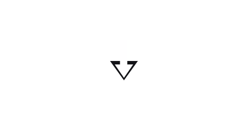

Sono Aloisi Matteo, Font End Developer e sono di Roma.

Ho utilizzato varie tecnologie e linguaggi tra cui

  
  
  
  
  
  
  
  

  

  

## Contattami

  <a href="https://github.com/AloisiMatteo" target="_blank">
   
    

